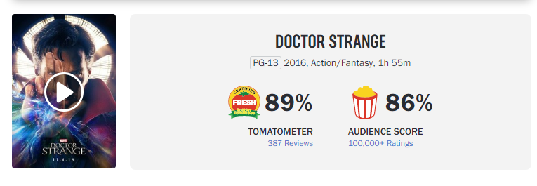
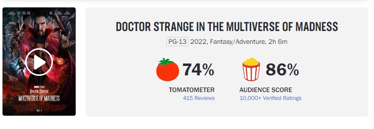

# Screenplay_Genre_Classifier

### Flatiron School Capstone

## Introduction

"While scholars dispute defintions and systems, the audience is already a genre expert. It entes each film armed with a complex set of anticipations learned through a lifetime of moviegoing." - Robert Mckee

Robert Mckee was the guy in Hollywood who would read and choose screenplays to be purchased. According to him, genre is an important element in drawing in the audience. Nowadays, I hold the opinon that Hollywood is not making good movies anmore. While genre is not the only element in creating a film, it is a very important one. For example, the new release of the Doctor Strange movie was a let down to the Marvel audience. There are probably a multitude of reasons but one reason that I recognizied is the fact that they advertised it as a horor film when it completely missed the mark. 

A clear difference in tomatometer review scores between the first movie and the sequel.

This leads me to the purpose of the project, which is to improve the screenplay buying process using Machine Learning and Natural Language Processing. This project's goal is to use multi-label classification in order to classifiy a screenplay to one or more genres. In a business setting, film studios can use this machine in order to buy screenplays based on the genres they want to produce. If a studio wants to produce a horror, action movie, then they will input the screenplays they have into the machine to see if they match up to those genres. It can work up to 18 genres which includes: Action, Comedy, Drama, Thriller, Horror, Adventure, Fantasy, SciFi, Music, Documentary, War, Western, Romance, Crime, Animation, Mystery, and Family.

## Data Sources

[1]: https://thescriptsavant.com/ "The Script Savant"
[2]: https://www.themoviedb.org/?language=en-US "The Movie Database API"
[3]: https://www.convertapi.com/ "ConvertApi"

About 2000 screenplays in pdf format were scrapped using Beautiful Soup from [The Script Savant][1] website (link).
The screenplays were converted to txt files using the [ConvertApi][3].
Lastly, the screenplays were labelled with their respective genre(s) using [The Movie Database API][2].

## Summary

### TextPreprocesser Custom Class

All of the text cleaning and preprocessing can be found in this class located in the preprocessing.py file. The class was used to test different preprocess techniques such as lemmatization and stemming. More specifically, WordNetLemmatization, TextBlob, and Pattern for lemmatization and Snowball Stemmer, Lancaster Stemmer, and Porter Stemmer. Ultimately, what proved to be the best results, was the WordNetLemmatization from the nltk package.

### Modeling Custom Class

The Modeling class can be found in the topicmodeling.py file. This class was specific to LDA topic modeling and main purpose was to streamline the process of testing and trying out different combinations of topic numbers, chunksizes, and passess. Due to time constraints, I was not able to add topic modeling technqiues to model building. Although, I plan for the future. (after June 3rd)

### Data Wrangling

Data Wrangling was broken up into three parts.

The first notebook data_collection.ipynb has all the code where I scraped the Script Savant and downloaded the pdf files. If you are looking to recreate this project, I have to warn you about the download time it took to extract the 2000 screenplays. About 6-8 hours.

The second notebook data_wrangling.ipynb has all the code for converting the pdf files to txt files and then using the Movie Database Api to label the screenplays with their respective genres. The conversion as well takes a long time. About four hours.

The third notebook data_wrangling_pt2.ipynb is where I do some basic cleaning on the title column. I also create the targets by using one hot enocoding on the genre column.

### Exploratory Data Analysis

EDA was also split up into two notebooks.

The first notebook EDA_pt1.ipynb is strictly bar plots illustrating the genre distribution given the screenplays. As noted in the notebook, Drama is the most frequent genre associated withs screenplays while Western is the least frequent. Conceptually, this makes sense since Drama is such a broad genre while Western is much more specific. Some other stats recognized was that there were 600 unique comibnations of genres, where comibnations ranged from 1 genre to 6 genres. Most genres were some combination of two or three genres.

The second notebook EDA_pt2.ipynb explored the word count with respect to genre. I illustrated word clouds before cleaning, after cleaning, after lemmatizing, and after lemmatizing and removing key stop words. These illustrations is what motivated me to choose WordNetLemmatization and the ideal intersection of words to eliminate from the training set in the preprocessing notebook.

### Preprocessing

In this notebook, I split the train and test sets with a test size of 30 percent. I perform the proper preprocessing techniques while avoiding data leakage. I made note of where data leakage occurred when creating the stop words list. When researching this project, I noticed many people on Medium and other sources use the entire dataset to find the optimal stop words list. That is data leakage because the training set has information about the test set. To avoid this, I only used the training set to retrieve the intersection of words for my stop words list.

### Modeling

In this notebook, I used two main multilabel classifiers: OneVsRestClassifier and ChainClassifier. I tried out various base estimators such as LogisticRegression, RandomForestClassifier, and GradientBoosterClassifier. The metric observed was hamming loss which is the fraction of wrong labels to all labels. I chose this metric for many reasons. First reason was that I thought accuracy would not be a good metric. Accuracy would require the machine to predict every element of the output array (18 elements). Additionally, there is simialrity between genres. For example, Fantasy and SciFi are very similar while War and Western are as well. The goal was not to achieve perfect hamming loss but was to illustrate that some screenplays can be wrongly classified. Overall, each model provided similar hamming losses between 0.1 and 0.17. This is ideal because closer to zero the better, although, to know how effective the model is, will require me to look at the testing screenplays individually and observing the hamming_loss by genre. So I also analyze the results of the best classifier and their respective movies. I looked at screenplays with high hamming loss and compared them with screenplays with low hamming loss. I also looked at average hamming loss by genre and by genre length.

